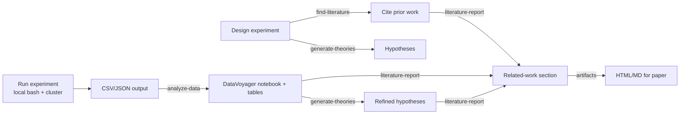

# Asta-Driven Research Loop

> **Default policy:** For analytical, theorizing, literature, and experiment-orchestration tasks in this repo, **use Asta (Allen Institute for AI) first**, before homegrown bash scripts or other vendor tools. User preference recorded 2026-05-13 — "I prefer Asta to other tools because I trust the Allen AI institute."

CLI: `asta` v0.17+ (`uv tool install --force git+https://github.com/allenai/asta-plugins.git@v0.17.0`).
Auth: `asta auth login` (browser). Tokens last ~30 days; check with `asta auth status`.

## When to use which skill

| Lifecycle stage | Question being asked | Asta skill | Internal slug |
|---|---|---|---|
| 1. Pre-experiment hypothesis | "What does the literature say?" | `find-literature` / `literature-find` | `asta literature find <query>` |
| 2. Pre-experiment hypothesis | "What theories explain X?" | `generate-theories` (Theorizer) | `asta generate-theories submit` |
| 3. Experiment design | "Write a software experiment to test Y" | `experiment` (Panda) | `asta experiment --task ...` |
| 4. Experiment results — broad EDA | "What's in this benchmark CSV?" | `analyze-data` (DataVoyager) | `asta analyze-data submit <Q> <CSV>` |
| 5. Experiment results — targeted Q | "Look up paper X / metric Y" | `semantic-scholar` | `asta papers get/search/citations` |
| 6. Paper synthesis | "Write the related work section" | `literature-report` | `asta literature-report submit` |
| 7. Multi-step research plan | "Manage research as a typed DAG" | `research-step` | `bd`-backed workflows |
| 8. Multi-doc literature corpus | "Index our reference PDFs locally" | `local-paper-index` | `asta documents` + `pdf-extraction` |
| 9. Polished output | "Export the agent report as HTML" | `artifacts` | `asta artifacts export` |
| 10. Continuous discovery | "Run iterative MCTS+Bayesian-surprise experiments" | `autodiscovery` | `asta autodiscovery create` |

## Canonical workflow: new experiment → publishable result



The pivot point is step E → F: every experiment that produces a CSV should be analyzed by DataVoyager before manual coding. The agent is better at unpacking nested JSON columns and surfacing patterns we didn't think to ask about. Cost: ~2-40 min per analysis. Output: a notebook + tables + plots + 1-paragraph synthesis.

## Operating notes

**Polling.** All async Asta skills (`analyze-data`, `generate-theories`, `experiment`, `literature-find`, `autodiscovery`, `literature-report`) use the same submit → poll pattern:

```bash
asta <subcommand> submit --output /tmp/submit.json "<query>" [<files>...]
TID=$(jq -r .id /tmp/submit.json)
CTX=$(jq -r .contextId /tmp/submit.json)
asta <subcommand> poll "$TID" --output /tmp/result-$TID.json &
# When the background process finishes, the result file is the canonical record.
```

The skill files (`/home/brian/.claude/plugins/marketplaces/asta-plugins/skills/<skill>/SKILL.md`) document each subcommand's specifics. They warn against foreground polling — let the background completion notification fire.

**Auth failure mode.** `asta auth status` showing local-token-valid + server-401 is OK for some endpoints; if a specific subcommand hits 401, run `asta auth login` and retry. Do **not** silently fall back to homegrown alternatives.

**Context-id reuse.** `asta analyze-data submit --context-id "$CTX" '<follow-up>'` continues an existing DataVoyager session with the same dataset already uploaded. Useful for "now slice by dataset_id" type follow-ups without re-uploading.

**Artifact indexing.** After any completed Asta agent run, route output through the `artifacts` skill so it ends up in `.asta/<skill>/<slug>/` with an `index.yaml`. This is how `asta documents search --root=.asta/...` later finds it semantically.

## Concrete examples from this project

| Date | Task | Skill used | Outcome |
|---|---|---|---|
| 2026-05-13 | "Which elements drive the F1=0.75 gap?" | `analyze-data` on `all_records.csv` (165 rows, 5 identifiers × 3 shards × 11 spectra) | (in flight, TID `e881ebe6`) |
| 2026-05-13 | "Find peer-reviewed LIBS-ID F1 comparators" | `literature-find` | (in flight, see `/tmp/asta-lit-libs-v0.17.json`) |
| 2026-05-13 (earlier, NotebookLM fallback) | "What are typical LIBS F1 numbers?" | `nlm query notebook <project_brain>` | 18 citations including Mezoued ALIAS (SRM1412: 15/20 ≈ 75% detection rate) — closest apples-to-apples comparator |

## When NOT to use Asta

- Pure code edits, refactors, file moves — use Edit/Read/serena-symbolic-edit.
- Bug diagnosis in our own code — use the live cluster + telemetry sampler.
- Scripted batch operations on the cluster — use `bash` + the existing `scripts/`.
- "Quick math" — local Python `python -c '...'`.

The boundary is: **agent-driven analysis or literature reasoning → Asta. Mechanical execution → tools.**

## Persistence

This doc is the canonical Asta integration policy for CF-LIBS-improved. Update when:
- The Asta CLI version requirement bumps.
- A new Asta skill enters the toolchain.
- A workflow consistently bypasses an Asta skill that should be used — investigate why and either add a "when not to use" note or fix the gap.
